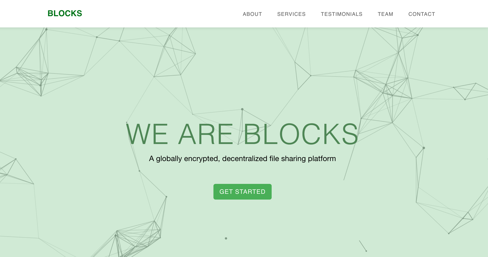

## Blocks is a Decentralized File Storage Platform (Eth Blockchain & IPFS) 

## Introduction
Blocks is a decentralized file storage and sharing app that leverages the power of peer-to-peer protocols and the Ethereum Blockchain to offer a storage alternative to traditional, centralized, storage applications (e.g. Dropbox, Google Drive, etc.) When a user uploads a file through Blocks, it is encrypted and stored on the IPFS. This returns a unique content identifier (CID), which can be used to retrieve the encrypted file from the IPFS later. Rather than storing the CIDs in a central, fallible, database, Blocks stores these CIDs on the Ethereum Blockchain. 


## About Blocks

By storing files and file information on the distributed net and blockchain, Blocks offers a number of benefits that cannot be provided by Web 2.0 server-based storage/retrieval systems:

#### Accessibility
As information is stored over wide networks (IPFS and Blockchain), there is no risk of files becoming inaccessible due to server failure. File contents are hosted on multiple nodes on the network, so even if one (or ten) nodes go offline, there are multiple redundant copies available for access. 

#### Immutability
File identifier hashes (the CIDs) are dependent on the contents of the block, and any attempts to alter the contents (whether malicious or not), will produce a different CID that cannot be substituted in place of the original information. Retrieving file contents by CID ensures that what is returned is explicitly the file that would generate that CID.

#### Resistance to Censorship
As information stored through Blocks is decentralized, it cannot be blocked or restricted by a single entity (e.g. restrictive governments). This has been seen in practice when the Turkish government blocked local access to Wikipedia in 2017 - In response, the entirety of Wikipedia was promptly hosted on the distributed net. 

## Technologies used 🛠️

- Key Technologies & Tools Used: PERN stack (PostgreSQL, Express, React, Node.js), IPFS, Solidity, Web3.js, Truffle, Ganache, MetaMask.
- Blocks was primarily written in JavaScript, using React for the front-end user interfaces, and a PostgreSQL database to store user login information. File encryption involves an AES256 cypher algorithm. File bodies were stored using the IPFS, while the Ethereum Blockchain was used for the storage of the file hashes necessary for file retrieval. Our Node.js application was connected to the blockchain via the Web3.js library, with our blockchain code contained in Ethereum Smart Contracts, which were written in Solidity and compiled/deployed with Truffle. During development, we deployed our blockchain code onto a locally hosted Ganache test network, while our final product is deployed on the Rinkeby global test network. Lastly, Blocks uses MetaMask as the user portal to the blockchain, to approve storage transactions.

- [Solidity](https://docs.soliditylang.org/en/v0.8.10/) - [React](https://reactjs.org//) - [Web3.js](https://web3js.readthedocs.io/en/v1.5.2/) - [Sequelize](https://sequelize.org/) - [Express](https://expressjs.com/) - [Node.js](https://nodejs.org/en/) - [Ganache](http://trufflesuite.com/ganache//) - [Bootstrap 4](https://getbootstrap.com/docs/4.3/getting-started/introduction/)

## Run Blocks Locally

```
git clone https://github.com/FullStack-Capstone-2109-KFT/Blocks
cd react-truffle-metamask
Install ganache
npm install -g ganache-cli
Install truffle
npm install -g truffle
Build repo
yarn install
truffle compile
Start repo
Open a new console
ganache-cli
truffle migrate
yarn start
```

## Authors

- David Kremenitzer - [https://github.com/Davidkrem](https://github.com/Davidkrem)
- Jordan Oetting - [https://github.com/J-Oetting](https://github.com/J-Oetting)
- Takumi Otsuka - [https://github.com/totsuka1](https://github.com/totsuka1)
- Davide Lepri - [https://github.com/Davide3520](https://github.com/Davide3520)

### Capstone Presentation Video

- Coming soon

### Live Demo

- https://blocks-kool.herokuapp.com/
